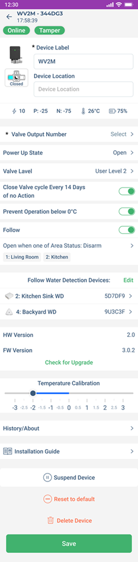
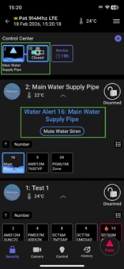

# Configuring the WV2M

To configure the WV2M settings:

1. When in the Hardware, tap the WV2M device.
2. On the page that opens, enter the necessary details for the parameters and then tap Save.
    For details see the following table.

| Parameter | Description |
|-----------|--------------|
|**Device Details**         |Enter a name for the zone.    |
|**Valve Output Number**   |Assign a number to the valve.      |
|**Power Up State** |  Select the default state of the valve:  - Open  - Close - No Change|
|**Valve Level**| Choose one of the following options:  - User Level 1 (All Permitted) - The installer, site owner, or site master can activate the water valve. A user can activate it only if the PGM Scenario Activation option is enabled in their profile.   -  User Level 2 – The installer, site owner, or site master can activate the water valve. A user can activate it only if both PGM Scenario Activation and Restricted PGM/scenario options are enabled in their profile.
|**Close Valve Cycle Every 14 Days of no action**| When enabled, the system automatically cycles (closes and reopens) the valve if it remains open for 14 days without any user action, preventing sticking or malfunction.
|**Prevent Operation below 0°C**| Prevents the valve from operating when the temperature drops below 0°C to avoid freezing issues.
|**Follow** | When enabled, the valve will operate according to the area status, or the configured schedule.|
|**Follow Water Detection Devices**| Select water detection devices whose status the valve will follow.|
|**Temperature Calibration**| Allows manual calibration of the device's reported temperature to match the actual ambient temperature.|
|**Suspend Device**| Disables monitoring of the device in the system.|
|**Reset to Default**|This will reset the device to the factory default settings.   **note** Only an installer can reset the device.
|**Delete Device**| This option deletes the device from the system completely. After deletion, the system generates a push notification only if the owner registration is complete, not during installation.   **note** Only an installer can delete the device.|

  

When a water leak is detected by a water detector assigned to the WV2M, an alert appears in the Control Center.

