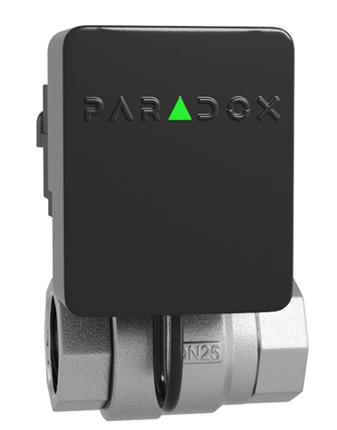

# WV2M Installation Manual

Welcome! This installation manual contains the following sections.

- [Introduction](introduction.md)
- [Quick Installation](quick_installation.md)
- [Components](components.md)
- [Physical Mounting](physical_mounting.md)
- [Pairing WV2M with the Wireless M Console](pairing.md)
- [Configuring the WV2M](configuring.md)
- [Manual Override](manual_override.md)
- [Repalcing Battery](replacing_battery.md)
- [LED Indications](led_indications.md)
- [Resetting](resetting.md)
- [Upgrading Firmware](upgrading_firmware.md)
- [Technical Specifications](tech_spec.md)

