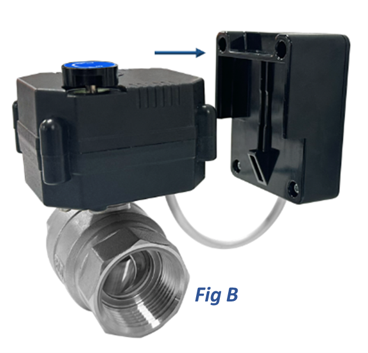

# Replacing Battery

To replace the battery:

1. Detach the Valve Driver from the motor as shown in Fig B.
2. Remove the four screws from the back of the Valve Driver.
3. Remove the front cover of the Valve Driver.
4. Replace with new batteries. Ensure correct polarity.
5. Reattach the front cover and secure the Valve Driver back onto the motor.  

